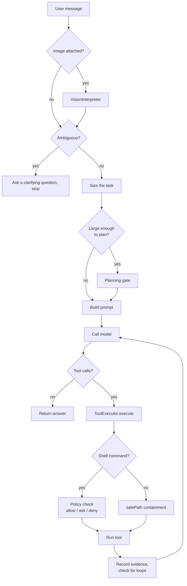

# Architecture

How EmergeX Code is put together, and where to look when you want to change something.

This document describes what is in the repository today. Where a subsystem is partially built, it says so.

---

## The shape of the thing

EmergeX Code is a coding agent that runs against a local model. There is no server in the request path. The agent process reads your files, calls a model over HTTP on localhost, and writes files back.

Three layers, and everything else hangs off them:

| Layer | Where | Responsibility |
|---|---|---|
| **Interface** | `apps/tui/` | Renders the session. Owns nothing but display and input. |
| **Agent** | `packages/emergex/` | Owns the turn: prompt assembly, the tool loop, session state. |
| **Capabilities** | `packages/*` | Everything the agent can *do*. Each is usable on its own. |

The rule that keeps this honest: **capability packages do not import the agent.** `packages/memory` has no idea an agent exists. That is what makes them callable from a script, a daemon, or a test without booting a TUI.

---

## A turn, end to end

`Agent.chat()` in `packages/emergex/agent.ts` is the entry point. One user message goes in, one assistant message comes out, and an arbitrary number of tool calls happen in between.



The pieces worth knowing:

- **Prompt assembly** (`prompt.ts`, `prompts/system-prompt.ts`) injects user context and relevant memories on every turn, so the prompt is not static.
- **The tool loop** runs until the model stops asking for tools. `tool-loop-detector.ts` watches for the same failing call repeating and injects a warning after three attempts rather than letting the model spin.
- **Evidence** (`packages/validation/evidence.ts`) records what actually happened during the turn, so a claim of success can be checked against tool results rather than taken on trust.
- **Compaction** (`compaction.ts`) trims history when the context fills up.
- **Abort** is real. `agent.abort()` cancels the in-flight model stream, which is what ESC is wired to.

---

## The tool surface

`packages/emergex/tools.ts` defines every tool the model can call and executes them. There are 35 on `main` today, plus `search_content` pending in #7.

| Group | Tools |
|---|---|
| Files | `read_file`, `write_file`, `edit_file`, `list_files` |
| Code structure | `get_outline`, `get_symbol`, `search_symbols`, `get_project_outline` |
| Git | `git_status`, `git_diff`, `git_log`, `git_add`, `git_commit` |
| Shell | `run_command` |
| Sub-agents | `spawn_agent`, `check_agent`, `list_agents` |
| Web | `web_search`, `web_fetch`, `browser_open`, `browser_state`, `browser_task`, `browser_screenshot` |
| Memory | `remember`, `recall` |
| Deploy | seven `vercel_*` tools |
| Design | `suggest_design`, `query_design_system` |
| Mode | `enable_infinite_mode` |

Two conventions matter when adding one:

1. **Bound the output.** A tool that can return a whole minified bundle will eat the context window and the turn dies. Cap results, clip long lines, and skip binaries and `node_modules` before opening anything.
2. **Do not shell out for something you can do natively.** `run_command` depends on the host toolchain, differs between GNU and BSD, returns unstructured text, and passes the policy gate. Native beats a shell escape hatch.

---

## Where the safety boundary actually is

Worth being precise, because the two paths differ:

- **Shell commands** go through the NemoClaw policy engine (`packages/permissions/policy-engine.ts`). `runCommand` calls `checkPermission()`, which returns `allow`, `ask`, or `deny` from YAML rules. `ask` prompts the user. Policies are deny-by-default and readable at `packages/permissions/default-policies.yaml`.
- **File tools** are constrained by `safePath()`, which resolves the target and keeps it inside the working directory. This is path containment, not policy evaluation. A file write inside the project does not raise a prompt the way a shell command can.

So the shell is the gated surface, and the filesystem is the contained one. If you add a tool that reaches outside the working directory or spawns a process, it belongs behind the policy engine.

---

## Repository map

**7 apps.**

| App | What it is |
|---|---|
| `apps/tui/` | The terminal interface. Ink v6, React for the CLI. Largest app by far. |
| `apps/clui/` | Tauri 2.0 desktop overlay. |
| `apps/dashboard/` | Web dashboard. |
| `apps/debugger/` | Session inspection. |
| `apps/installer/` | First-run setup wizard. |
| `apps/lil-emergex/` | macOS dock companion (Swift). |
| `apps/demos/` | Demo recordings and media. |

**52 packages.** Grouped by what they are for rather than alphabetically:

*The agent itself*
- `emergex/` - turn loop, tools, prompts, sessions
- `ai/`, `providers/` - provider abstraction, task routing, failover
- `executor/`, `planner/`, `planning/` - task decomposition

*What the agent can do*
- `tools/` - the utility layer, and the largest package in the repo
- `ast-index/` - import graph and change-impact analysis
- `memory/` - SQLite + FTS5, episodic and semantic recall
- `computer/` - desktop automation
- `music/`, `voice/` - audio in and out
- `mcp/` - Model Context Protocol client

*Guardrails*
- `permissions/` - the NemoClaw policy engine
- `validation/` - checkpoint, verify, revert
- `secrets/` - credential vault
- `hooks/` - lifecycle interception

*Autonomy*
- `self-autonomy/` - reflection, skill confidence, HyperAgent meta-mutation
- `orchestration/` - git worktree pool for parallel agents
- `infinite/` - unattended run mode
- `kernel/` - RL fine-tuning pipeline, **off by default**

*Surface area*
- `daemon/` - persistent vessel process
- `telegram-bot/`, `channels/` - remote control
- `skills/`, `extensions/` - loadable capability packs
- `design-systems/`, `personality/` - design tokens and brand voice

The remaining packages (`db`, `auth`, `registry`, `i18n`, `cron`, `lsp`, and others) are smaller supporting pieces.

---

## Reading order

If you are new to the codebase and want the shortest path to understanding it:

1. `packages/emergex/agent.ts` - `chat()` is the whole story in one method
2. `packages/emergex/tools.ts` - the tool schema array, then `execute()`
3. `packages/permissions/default-policies.yaml` - what the agent may and may not do
4. `apps/tui/src/index.tsx` - how the session is rendered

---

## Testing

The repository's own suite is scoped to source:

```bash
bun run test              # packages/ and apps/
bun run test:benchmarks   # the benchmark fixtures, separately
```

The two are deliberately separate. Files under `benchmarks/categories/*/tests/` are **task specifications, not tests of this repository**. They import their subject from `WORK_DIR`, a directory holding code a model generated during a benchmark run, so with no generated code present they fail by design. A failure there measures a model. A bare `bun test` from the repo root collects both and reports hundreds of failures that mean nothing.

---

## Honest status

Per the evidence rule in `CLAUDE.md`, a subsystem is only called finished if it is:

| Area | Status |
|---|---|
| Agent turn loop, tool execution, sessions | Working, in daily use |
| Policy engine | Working, deny-by-default, gates the shell |
| Memory, episodic and semantic recall | Working |
| Memory health monitoring, contradiction detection | In progress |
| AST index and change impact | Working |
| HyperAgent meta-mutation | Specified, partially built |
| RL fine-tuning (`packages/kernel/`) | Built, off by default |
| Repository test coverage | Early. Most of `packages/` has no tests yet. |
| Typecheck and lint | Not clean. See the tracking issues. |

That last pair is worth stating plainly rather than hiding: `bun run typecheck` reports errors today, and `biome check` reports more. Both are being reduced. Do not assume a green local build.
